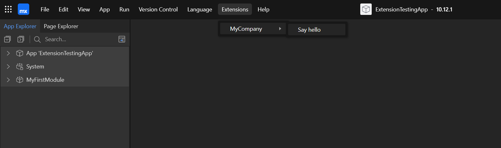

# mx-role-access-extension
A Mendix Studio Pro extension that generates an access report


## Getting Started

Clone this repostiory

### Prerequisites

- Mendix Studio Pro 10.12 or higher [https://marketplace.mendix.com/link/studiopro](https://marketplace.mendix.com/link/studiopro)

- .NET SDK [https://dotnet.microsoft.com/en-us/download](https://dotnet.microsoft.com/en-us/download)

You can verify you have the .NET SDK installed by running the following command in Powershell:

```powershell
dotnet --version
```

### Starting Stuido Pro

As of right now, the Extension API is still in beta. To enable the Extension API, you need to start Studio Pro from Powershell using the following command:

```powershell
Start-Process -FilePath "C:\<YOUR>\<MENDIX>\<INSTALLATION>\modeler\studiopro.exe" -ArgumentList "--enable-extension-development"
```

If you have Mendix installed in the default location, the command would look like this:

```powershell
Start-Process -FilePath "C:\Program Files\Mendix\10.12.1.39914\modeler\studiopro.exe" -ArgumentList "--enable-extension-development"
```

Once Studio Pro is open, you can open the test project by clicking "Open App Locally" and navigating to the ExtensionTestingApp folder inside this repository.


### Building the Extension

To build the extension, navigate to the root of the repository and run the following command:

```powershell
dotnet build
```

This will build the extension, and copy the dll to the correct location in the test project.

### Sync the project folder

Back in Studio Pro, you will need to sync the project folder to see the extension. To do this, click on the App -> Syncronize Project Directory menu item. You can also use the F4 key. 

The Extension should now be visible in the Extensions -> MyCompany topbar menu.


